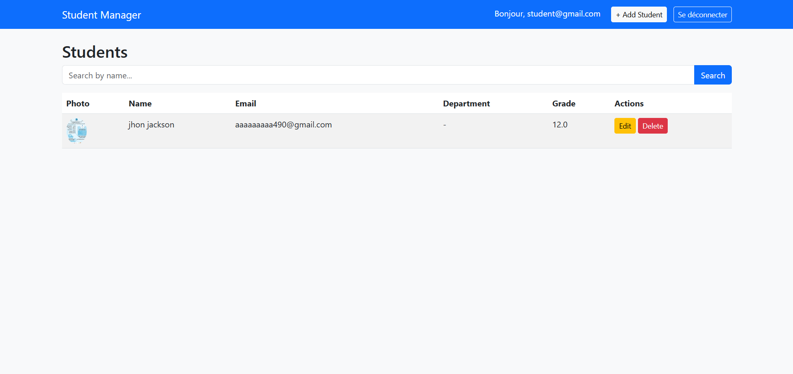
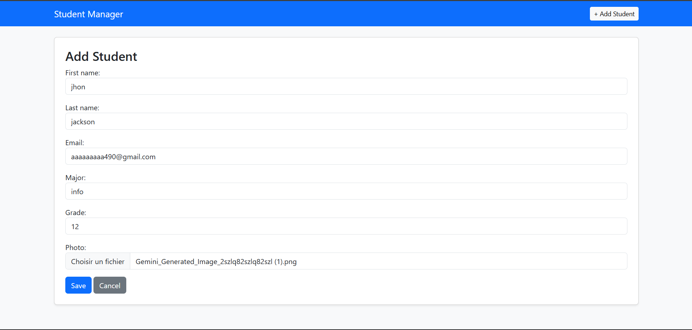
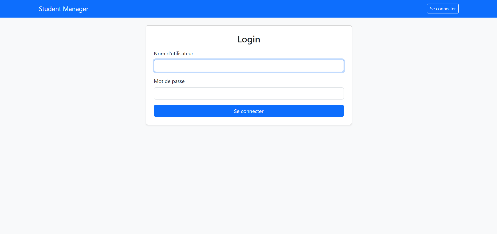

# 🎓 Gestion des Étudiants - Projet Django

**Module :** 🐍 Programmation Python Avancée | **Niveau :** 🎓 3E Info  
**Enseignant :** 👨‍🏫 Dr. Sghaier Amra | **Date limite :** ⏰ 28/04/2026

<div>
    <div style="display: flex; justify-content: center; gap: 20px;">
        
        
    </div>
    <div style="display: flex; justify-content: center; margin-top: 10px;">
        
    </div>
</div>

---

## ✨ Fonctionnalités

- 🔄 CRUD complet (Créer, Lire, Mettre à jour, Supprimer) pour les étudiants
- 🗄️ Base de données SQLite3
- 🏗️ Architecture MVT (Modèle - Vue - Template)
- 🎨 Style Bootstrap 5 *(bonus +1pt)*
- 🔍 Recherche par nom *(bonus +1pt)*
- 📄 Pagination (5 étudiants par page) *(bonus +1pt)*
- 🖼️ Téléchargement d'images (photo de l'étudiant) *(bonus +2pts)*
- 🔒 Système d’authentification (login/logout) *(bonus +2pts)*
- 🔗 Plus d’une table avec relation entre elles (Département -> Étudiant) *(bonus +2pts)*
- 📦 Environnement virtuel (venv)

---

## 📂 Structure du Projet

```
app_student/
├── venv/                        # Environnement virtuel (non poussé sur GitHub)
├── student_mgmt/                # Configuration du projet Django
│   ├── __init__.py
│   ├── settings.py              # Paramètres de l'app, INSTALLED_APPS, config MEDIA
│   ├── urls.py                  # Routeur principal des URL
│   └── wsgi.py                  # Point d'entrée WSGI
├── students/                    # Application Django
│   ├── migrations/              # Migrations de la base de données
│   ├── __init__.py
│   ├── admin.py                 # Configuration de l'interface d'administration
│   ├── apps.py                  # Configuration de l'application
│   ├── models.py                # Modèle Étudiant et Département (tables de base de données)
│   ├── views.py                 # Logique CRUD + recherche + pagination + authentification
│   ├── forms.py                 # Formulaire étudiant (ModelForm)
│   ├── urls.py                  # Modèles d'URL au niveau de l'application
│   └── templates/               # Templates HTML
│       ├── registration/        # Templates d'authentification
│       │   └── login.html       # Page de connexion
│       └── students/            # Templates de l'application
│           ├── base.html        # Mise en page de base avec barre de navigation Bootstrap
│           ├── list.html        # Liste de tous les étudiants + recherche + pagination
│           ├── form.html        # Formulaire d'ajout / modification
│           └── confirm_delete.html  # Page de confirmation de suppression
├── media/                       # Photos d'étudiants téléchargées (créées automatiquement)
├── db.sqlite3                   # Base de données SQLite
├── image.png                    # Capture d'écran 1
├── image1.png                   # Capture d'écran 2
├── README.md                    # Documentation du projet
└── manage.py                    # Outil de gestion Django
```

---

## 🚀 Commandes d'Installation

### 1. Créer et activer l'environnement virtuel

```bash
# Créer le venv
python -m venv venv

# Activer (Windows - Invite de commandes)
venv\Scripts\activate

# Activer (Mac / Linux)
source venv/bin/activate
```

> Vous verrez `(venv)` au début de la ligne de votre terminal lorsqu'il sera actif.

### 2. Installer les dépendances

```bash
pip install django pillow
```

- `django` — le framework web
- `pillow` — requis pour le téléchargement d'images (ImageField dans le modèle)

### 3. Créer le projet et l'application Django

```bash
django-admin startproject student_mgmt .
python manage.py startapp students
```

- `startproject` — crée le dossier de configuration principal du projet (`student_mgmt/`)
- `startapp` — crée l'application `students/` avec des modèles, des vues, etc.
- Le `.` à la fin de startproject place `manage.py` dans le dossier courant

### 4. Créer et appliquer les migrations de base de données

```bash
python manage.py makemigrations
python manage.py migrate
```

- `makemigrations` — lit votre `models.py` et crée un fichier de migration décrivant les modifications
- `migrate` — applique ces modifications à la base de données SQLite3 (crée la table réelle)

> Si `makemigrations` indique "No changes detected", votre fichier `models.py` n'est peut-être pas enregistré correctement. Sélectionnez tout, supprimez, collez à nouveau et appuyez sur Ctrl+S.

### 5. Lancer le serveur de développement

```bash
python manage.py runserver
```

Ensuite, ouvrez votre navigateur à l'adresse : **http://127.0.0.1:8000**

### 6. Créer un superutilisateur (facultatif, pour le panel d'administration Django)

```bash
python manage.py createsuperuser
```

Ensuite, allez sur **http://127.0.0.1:8000/admin** pour gérer les données via l'interface d'administration.

> **🔐 Compte de test :**
> Un compte de test avec les privilèges administrateur a été créé pour tester le système de connexion et d'administration :
> - **Login / Username :** `student@gmail.com`
> - **Mot de passe :** `123`

---

## 🎨 Bootstrap 5 — Ce qui en découle

Bootstrap est chargé via CDN dans `base.html` :

```html
<link href="https://cdn.jsdelivr.net/npm/bootstrap@5.3.0/dist/css/bootstrap.min.css" rel="stylesheet">
```

Les classes et composants suivants proviennent de Bootstrap (vous n'avez pas écrit ce CSS vous-même) :

| Élément | Classe(s) Bootstrap utilisée(s) |
|---|---|
| Barre de navigation | `navbar`, `navbar-dark`, `bg-primary`, `navbar-brand` |
| Mise en page | `container` |
| Boutons | `btn`, `btn-primary`, `btn-secondary`, `btn-warning`, `btn-danger`, `btn-sm`, `btn-light` |
| Style de tableau | `table`, `table-striped` |
| Barre de recherche | `input-group`, `form-control` |
| Champs de formulaire | `form-control` (appliqué via les widgets Django dans `forms.py`) |
| Conteneur de carte | `card`, `p-4`, `shadow-sm` |
| Pagination | `pagination`, `page-item`, `page-link` |
| Photo de l'étudiant | `rounded-circle` |
| Arrière-plan | `bg-light` |
| Espacement | `mb-3`, `mb-4`, `mt-4` |

---

## 🌐 Routes URL

| URL | Vue | Description |
|---|---|---|
| `/` | `student_list` | Accueil — lister tous les étudiants |
| `/students/` | `student_list` | Même page de liste |
| `/add/` | `student_create` | Ajouter un nouvel étudiant |
| `/edit/<id>/` | `student_update` | Modifier un étudiant existant |
| `/delete/<id>/` | `student_delete` | Supprimer un étudiant |

---

## ☁️ Pousser sur GitHub

```bash
# Initialiser git
git init

# Créer .gitignore pour exclure venv et les fichiers téléchargés
echo "venv/" > .gitignore
echo "*.pyc" >> .gitignore
echo "media/" >> .gitignore
echo "__pycache__/" >> .gitignore

# Préparer et valider tous les fichiers
git add .
git commit -m "Projet initial de gestion des étudiants Django"

# Lier à votre dépôt GitHub et pousser
git remote add origin YOUR_GITHUB_URL
git push -u origin main
```

Remplacez `YOUR_GITHUB_URL` par le lien vers votre dépôt GitHub.  
Soumettez le lien GitHub sur **Classroom** avant le **28/04/2026**.

---

## 📝 Notation

| Critère | Points |
|---|---|
| Opérations CRUD (4 opérations avec base de données) | 8 pts |
| Structure du projet (MVT, venv, SQLite) | 3 pts |
| Templates (HTML + Django Template Language) | 2 pts |
| Qualité et organisation du code | 2 pts |
| **Total** | **15 pts** |

| Bonus implémenté | Points |
|---|---|
| Framework CSS Bootstrap | +1 pt |
| Fonctionnalité de recherche | +1 pt |
| Pagination | +1 pt |
| Téléchargement d'image | +2 pts |
| Système d’authentification (login/logout) | +2 pts |
| Plus d’une table avec relation entre elles | +2 pts |
| **Total bonus** | **+9 pts** |

---

## 🌍 Déploiement en Ligne Render

Le projet a été déployé sur **Render** et est accessible à cette adresse :  
👉 **[https://projet-django-2-qjcu.onrender.com/](https://projet-django-2-qjcu.onrender.com/)**
